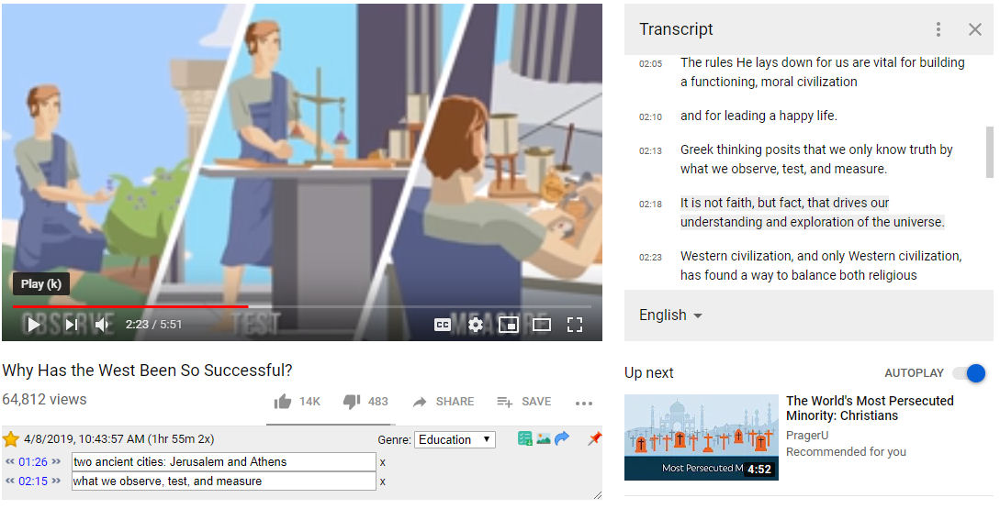

#   Vuntec Video Notes

[Get at Chrome Web Store ( version 0.9.3 ) ](https://chrome.google.com/webstore/detail/vuntec-video-notes/olbkhhjjhfihgkhcggcbhegpnljlndlc).

Bookmark a note at any point in a YouTube video!

Keep track of and quickly find important parts of your favorite YouTube videos

# Quick Start

1) [Install "Vuntec Video Notes" Chrome Extension ](https://chrome.google.com/webstore/detail/vuntec-video-notes/olbkhhjjhfihgkhcggcbhegpnljlndlc)

2) Go to any YouTube video with url **/watch?v=**

3) click the   button and add notes as you watch YouTube videos.

# Features

## Extention Popup Dialog

Once the Extension is installed you will see the Extension's icon in the Chrome toolbar. Clicking the icon will open a popup dialog window.

---
## Anatomy of the Note Area

The new note area will now be added to all your YouTube Video pages.

1) Favorite Star
2) Date and Time Originally Bookmarked
3) Time since created and number of visits to the page
4) Toolbar
5) Note time control.
6) Note
7) Remove note

---

## Toolbars 

### Add a note

*   
* or press the "+" key

### Generate Preview Sheet

*  

 * n.b. adding a "shift" click will create a list that adds a direct URL link to the note. Helpful if you want to copy and send to someone

### Grab Frame 

* 

### Last place viewed from last visit

*   

### Mark Video a Favorite

* 
 * Click the star to turn favorite on and off

### Genre

   

## Transcript usage

The Extension will open the video's transcript if it exist and copy the active line when adding a note. _This feature can be turned off on the options page._

   

## Popup Info

Get feedback from Extension as you interact with it. _This feature can be turned off on the options page._

   

---

## Logged in

   icon if logged in

## Options

* **Genre** Add or Edit the Genre list. This is comma delimited
* **User Access**. Shower your level of access
* **Image size**. Change the size of the thumbnail image for the **View History Page**
* **Page size**. Change the number of notes per page for the **View History Page**
* **Open Transcript**.  Automatically open the transcript on the video page 
* **See Popup info**.  Get feedback from Extension as you interact with it on the video page 

---

## Preview Sheet
Generate a sperate window with a thumbnail link for each note.

---
# View History of Notes
See all the notes you created. You can also filter and sort them to help find what you are looking for. On the right are the keywords that the videos have which were added by their creators.

## Quick Preview in View History 

Mouseover any thumbnail to get a quick preview of the video for a quick visual search.

## Support or Contact

visit www.vuntec.com

---

#### Other info

Icons made by <a href="https://www.flaticon.com/authors/smashicons" title="Smashicons">Smashicons</a> from <a href="https://www.flaticon.com/" title="Flaticon">www.flaticon.com</a> is licensed by <a href="http://creativecommons.org/licenses/by/3.0/" 	title="Creative Commons BY 3.0" target="_blank">CC 3.0 BY</a>
