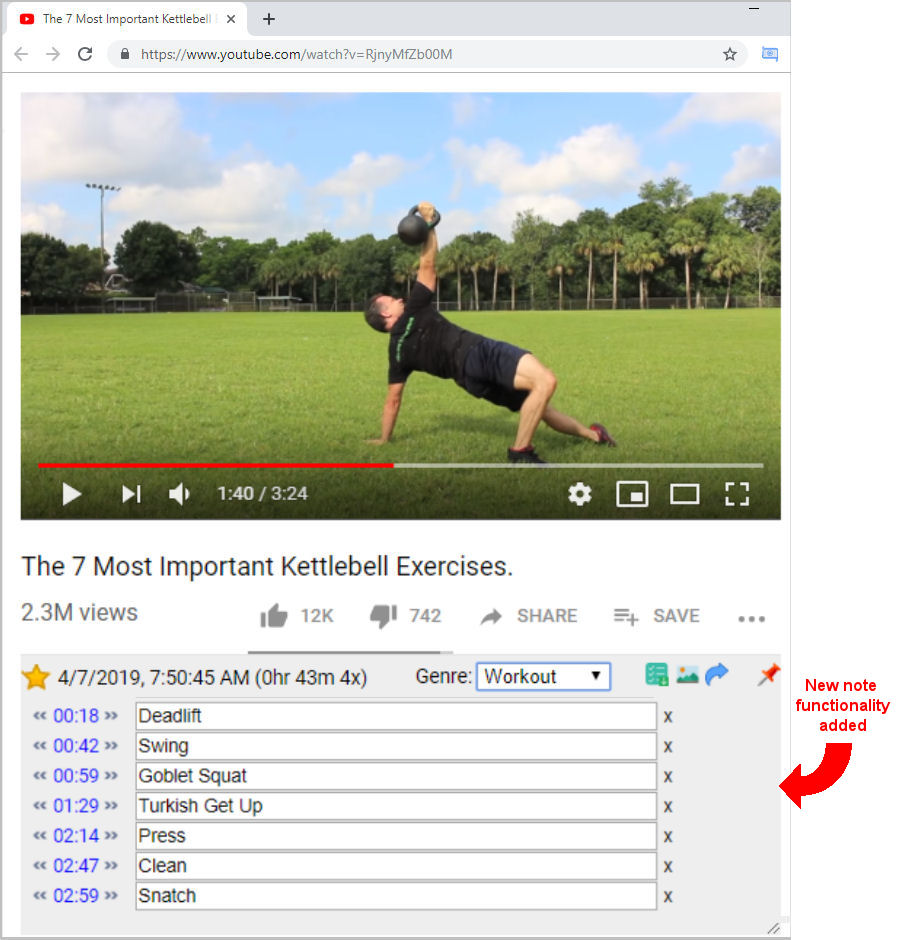

#   Vuntec Video Notes

[Get at Chrome Web Store](https://chrome.google.com/webstore/detail/vuntec-video-notes/olbkhhjjhfihgkhcggcbhegpnljlndlc)

Bookmark a note at any point in a YouTube video!

Keep track of and quickly find important parts of your favorite YouTube videos

# Quick Start

1) [Install "Vuntec Video Notes" Chrome Extension ](https://chrome.google.com/webstore/detail/vuntec-video-notes/olbkhhjjhfihgkhcggcbhegpnljlndlc)

2) Go to any YouTube video with url **/watch?v=**

3) click the   button and add notes as you watch YouTube videos.

# Features

## Extention Popup Dialog

---
## Anatomy of the Note Area

1) Favorite Star
2) Date and Time Originally Bookmarked
3) Time since created and number of visits to the page
4) Toolbar
5) Note time control
6) Note
7) Remove note

---

## Toolbars 

### Add a note

*   
* or press the "+" key

### Generate Preview Sheet

*  

 * n.b. adding a "shift" click will create a list that adds a direct url link to the note. Helpful if you want to copy and send to someone

### Grab Frame 

* 

### Last place viewed from last visit

*   

### Genre

   

---

## Logged in

   icon if logged in

## Options

---

## Preview Sheet

---
## View History of Notes

## Quick Preview

move mouse over thumbnail to get a quick preview of the video

## Support or Contact

visit www.vuntec.com

---

#### Other info

Icons made by <a href="https://www.flaticon.com/authors/smashicons" title="Smashicons">Smashicons</a> from <a href="https://www.flaticon.com/" title="Flaticon">www.flaticon.com</a> is licensed by <a href="http://creativecommons.org/licenses/by/3.0/" 	title="Creative Commons BY 3.0" target="_blank">CC 3.0 BY</a>
